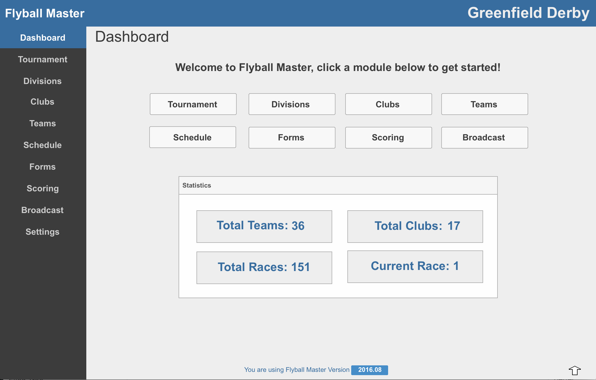

# Flyball Master v2017.2 Manual

Thank you for your interest in Flyball Master. My goal with this project is to bring a robust, modern scoring application to the sport we love. Flyball Master is an evolving project. We have a lot of great ideas for the software. Your feedback is VERY welcome. Please let us know what you like and don't like about the software.

## Features

Everything you need to Score and Inform including:

* Intuitive, easy to read User Interface
* Easy Schedule Conflict Resolution
* Intuitive Scoring Interface
* Live Race Updates for Participants
* Online Race Results \(coming soon...\)
* "Racing", "On Deck" and "In The Hole" with Race Time Estimates for Smartphones, tablets and desktops
* Event "Jumbotron" \(coming soon...\)
* Runs on Windows and Mac

Your support fosters the development of the software and makes the system even better. Please spread the word and help to make the software even better.

