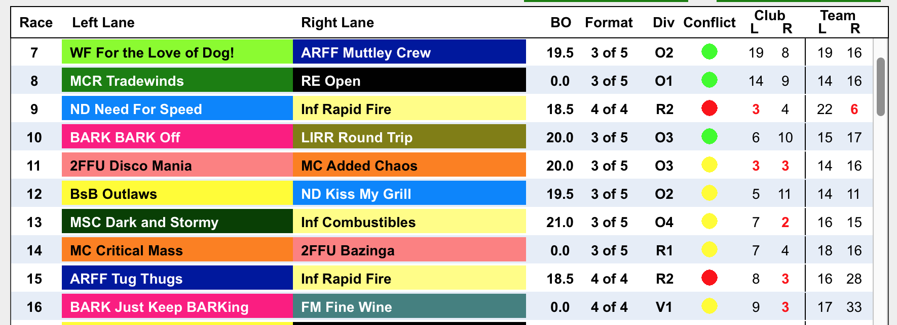

#Best Practices

If there is a conflict, the dot next to the race indicates whether the conflict is a team or club conflict. A Green dot indicates there are no conflicts for a race. A Yellow dot indicates there is a club conflict. A Red dot indicates there is a Team conflict.

On the right side of each race, there are 4 numbers. The first pairing of numbers indicates how many races to the NEXT race for the left and right Clubs. The second pairing of numbers indicates how many races to the NEXT race for the left and right Teams. Any number highlighted in red is the number causing a conflict.

Team conflicts are higher priority and will display even if there is a club conflict. (Race 9 above has both a Left Club conflict and a Right Team conflict. The race receives a red dot for the Team conflict.)

If a race has a yellow or red dot yet the Club and Team numbers are not in red implies the conflict is in a PRIOR race. This is the race that is in conflict with that prior race. (Race 14 in the graphic above. There is a club conflict with race 11)

Our recommendation for the most efficient method to resolve conflicts is as follows.

1) Starting at race 1, look for Team conflicts (red dots). When a conflict is located, look at the red number in the team conflict column. This number indicates how close the Team's next race is.

2) Subtract this number from 7 (for single ring tournaments). Remember this number.

3) Double click the race with the team conflict. Assign the new race number to be the current race number minus the result from step 2.

4) Continue this process through all the races until all the red dots are gone.

NOTE: If the event has a break for lunch or is a multi-day event, having red dots around these breaks is OK. Teams that are in conflict receive enough rest time due to the break. Smaller tournaments should plan to cluster team and club conflicts around these breaks.

5) Starting from Race one, do the same process for club conflicts. Do not attempt to resolve club conflicts until all team conflicts are resolve.
6) Look for a yellow dot in the schedule. The red number in the Club Conflict column indicates the number of races until the next club race.
7) Subtract this number from 4.
8) Double click the race with the club conflict. Assign the new race number to be the current race number minus the result from step 7.
9) If a team conflict results, resolve this before moving on with additional club conflicts.

Note: This process can result in an infinite loop between 2 clubs. You may need to  move a club an extra race or 2 and/or insert a non-conflicting club between the 2 races that can not be resovled.

Note: A club conflict is not as critical as a team conflict. Club conflicts indicate that racing may delay while a club swaps dogs for the race.

Note: Club Conflicts are OK around any planned breaks in the tournament schedule (lunch/day braks).

Note: IT IS NOT possible to eliminate all club tournaments. 

Note: Our experience is any number less than 30% club conflicts is acceptable.

Note: Tournaments seem to flow better if club conflicts are minimized at the start and the end of a tournament. This allows clubs to get into the swing of things when the tournament starts. Also, a smooth ending leaves a good impression of a well flowing tournament. Do your best to have as many green dots as you can at the start and end of your tournament in the schedule.

Note Again: **ELIMINATING ALL CONFLICTS IS IMPOSSIBLE**. At some point you have to admit the schedule is as good as you can get it and call it good ;-) 

