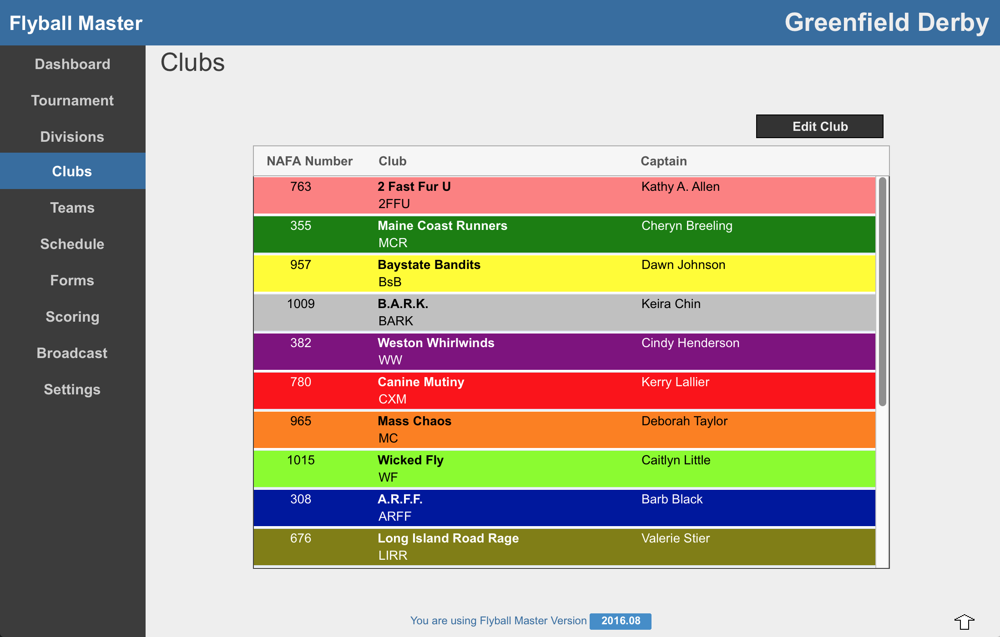
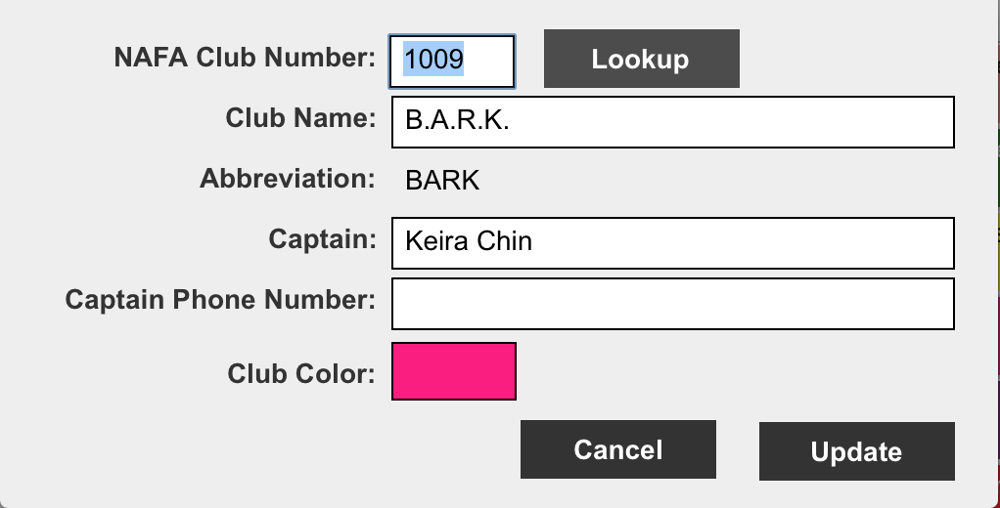

# Clubs
The Club screen lists all the clubs in the Tournament. The club name, abbreviation, NAFA club number and captain information are displayed. Also, if a color is assigned, the Club's row is highlighed in the Club's color.

Double clicking a Club or selecting a line and pressing the Edit Club button to open the Club Edit screen.

###Club Edit
The Club Edit screen updates the details of a Clubs. Type the NAFA ID of the club and press the <Lookup> button. Flyball Master retrieves the data about the club from the NAFA database to populate the fields.

Click on the team color field to assign a color to the team. Assigning Club colors is especially useful for conflict resolution with a new schedule.
