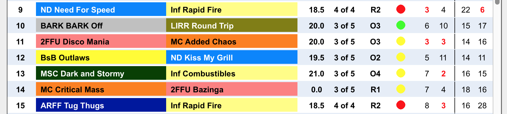
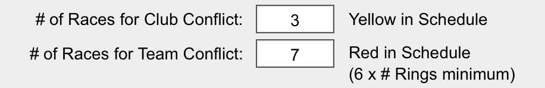

#Conflict Resolution

Flyball Master determines potential team and club conflicts when importing. A race that with a conflict shows either a yellow or red ball next to the race details. Races with no conflicts display a green ball.

Yellow dots indicate there is a conflict with the club. Red dots indicate the team has a conflict. 

(note: Club color may be yellow or red. A team highlighted in yellow or red signifies the Club color, not a conflict.)

Conflict determination is by the number of races the next time the team or club appear again in the schedule. The number of races triggering a conflict is configurable on the Settings screen.

To change the conflict numbers, navigate to the Settings screen. You will see 2 fields. Enter the number of races for both Team and Club conflict determination.

###Team Conflict Minimum
A team needs a minimum 45 minutes of rest before racing again. In a typical single ring, round robin Flyball Tournament, team conflicts should be set to minimum of 6. 

Our experience is that on average, a single race takes 7 to 8 minutes. 6 races allows teams between 42-48 minute interval between races. 6 is the minimum. Setting this to a higher number is desired however.

###Club Conflict Minimum
It is recommended that a club have a minimum of 3 races between racing so that members are able to transition between races. At multi-rings events, this number should be multiplied by the number of rings at the event.

###Multi Ring Tournament Minimums
In multi-ring tournaments, multiply conflict numbers by the number of rings at the event.

##Resolving Conflicts
Resolving conflicts is easy with Flyball Master. First step is to eliminate as many of the red conflicts as you can. Conflict resolution does take some practice. 

There are 2 methods to move a conflict race in the schedule.
 1) Click and drag (hold down the mouse button) to move the race to a new location. Release the mouse button to insert the race at the new location. 
 2)  Double click a race and enter the race number you'd like to move the race to.

Flyball Master's conflict resolution engine kicks in at this point. Any changes to conflicts are immediately displayed on the screen.

