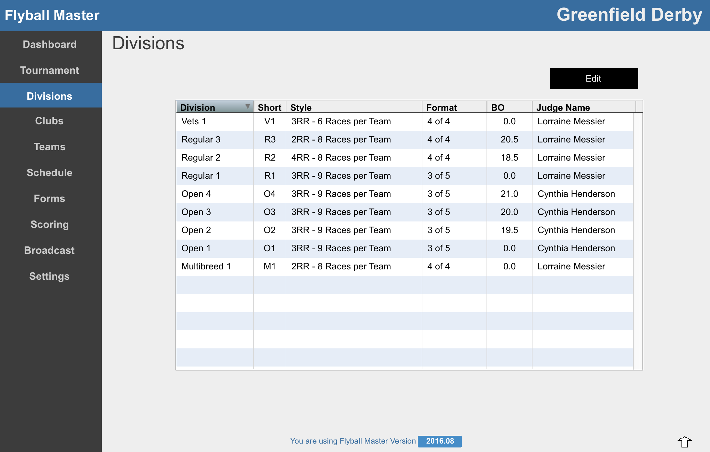
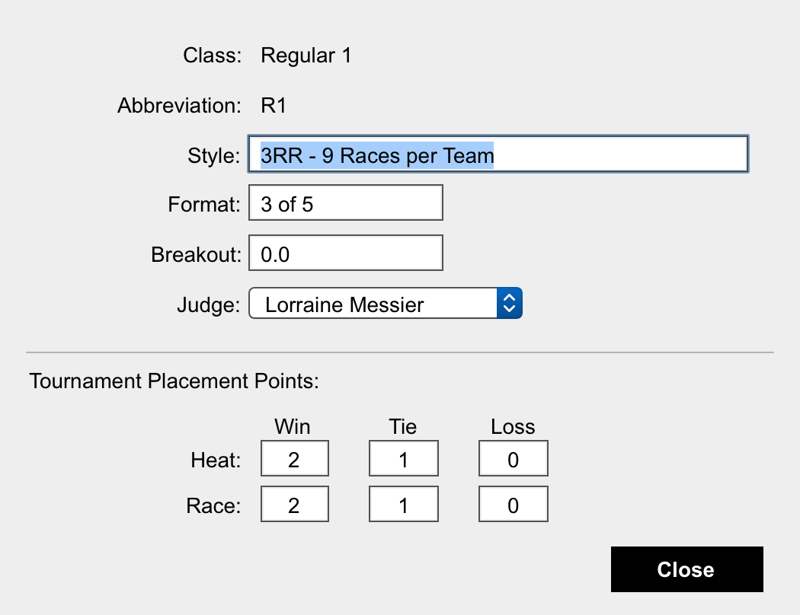

# Divisions

This screen shows the divisions the tournament has.

### Division Editing

Double click a Division or select a line and press the Edit button to open the Edit Division screen.

Style is a brief description of the Division's racing breakdown. Flyball Master is intended for scoring Round Robin toutnaments.

Format is for display only describing the format heats are run.

Breakout is the time that a team can not run faster than in this Division without receiving a penalty.

Judge indicates which Tournament Judge receives credit for NAFA requirements.

### Tournament Placement Points

Flyball Master handles scoring of the overall Tournament placements. Tournament points are assigned based on the information entered in this section of the Division screen.

Tournament points can be assigned for Heats, Races \(a group of Heats\), or for both. Typically one or the other is used in practice. It is common for races that are 4 of 4 to assign Tournament points by heat while 3 of 5 races typically assign Tournament points by Race and not for Heats.

#### \#\#\# 3 of 5 Tournament Points

Special consideration is given to assigning tournament points for 3 of 5 Races. For a team to receive the points for a "Win", the team MUST record 3 W's in the race. A TIE IS NOT CONSIDERED A WIN FOR TOURNAMENT POINTS IN 3 of 5 RACES.

