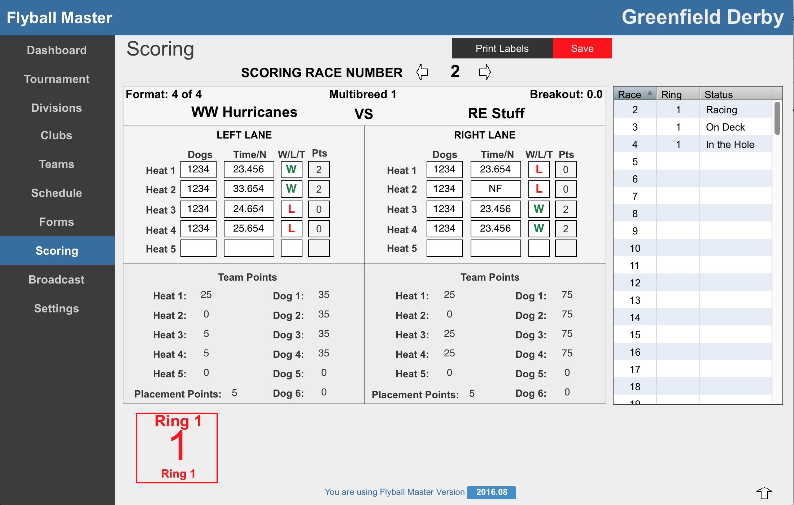

# Scoring

###Race Times
Enter in the times for each race. The decimal point is optional. To enter a "No Finish", press the N key on the keyboard (interferance is scored as a No Finish). Press the tab key to move to the next field. Flyball Master will automatically calculate which team won and lost based on the times entered.

There are many circumstances where the calculated won/loss must be over-ridden. To over-ride the value, click into the field and type a W, L or T in the field.

###Dog Entry
After the a race completes, the NAFA C2 forms return from each lane to the scoring table. The C2 Form lists the dogs that raced each heat for the race. The dogs must be entered into the scoring software.

Click or tab to the left team's Heat 1 dog entry field. Enter the numbers for the dogs from the C2 form for the team. Once 4 numbers are entered, the entry automatically moves to the next heat for the team.

Frequently, the dogs for each heat are the same. To copy the dogs from the previous heat press the space bar, return or enter key.

###Dog and Tournament Points
Flyball Master calculates points for Dogs running according to NAFA Rules. Tournament points are updates as each heat completes based on information entered on for each Division.

###Breakout
If a race time causes a breakout, the Scoring screen turns red and an notice is displayed. The Scorer should notify the Judge a breakout has occured and then close the breakout notice. Flyball master handles scoring the breakout automatically.

If the breakout was the result of an error in the race time, simply over-write the information that is automatically entered. 

###Online "On Deck" update
When racing completes, the system is able to update the current race number and store this online. Clicking the race number for the Ring number, advances the current race number by 1. This number is not tied at all to scoring and is used for participants to see which race is in each ring.

###Scoring Next Race
Once all data is entered and confirmed for the current race, click the right arrow at the top of the screen to advance scoring to the next race.

