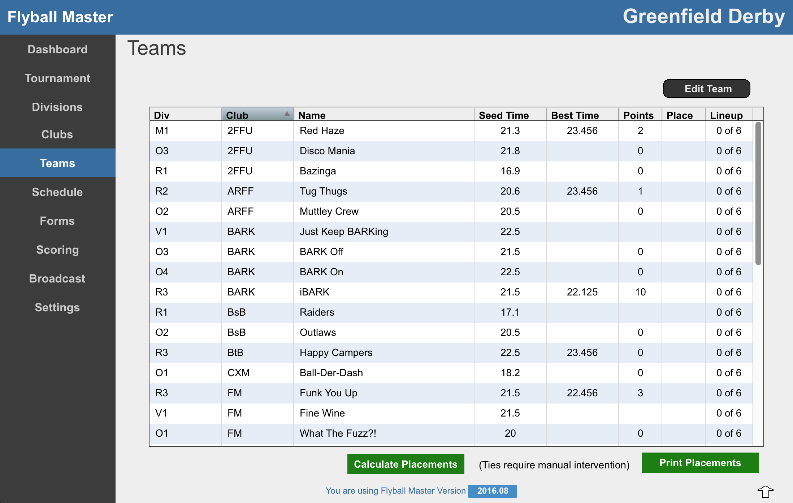
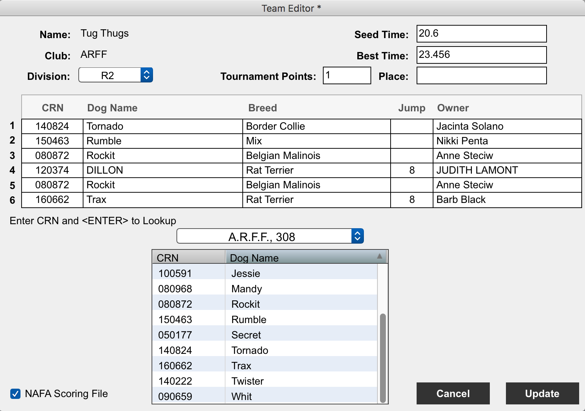

# Teams

The Team screen lists the teams in the Tournament. Click in a column heading to sort the list by a particular data element. Clicking the column heading a second time sorts the column in the opposite direction.

###Team Editing
Double click a team or select the Team and press the Edit Team button to go to the Team Edit Screen.

###Team Data
Many of the Team Data fields are pre-populated from either the schedule of are calulated as a tournament progresses. These numbers can be over-ridden by replacing the value in the appropriate location.

###Team Dogs
A pop-up menu displays the dogs for the current team. This menu does contain all teams in the tournament but will always defualt to the current team. If this Team is an open team, dogs on other teams are easily accesible form the pop-up menu.

NAFA data for a dog is looked up from the NAFA database. In the CRN field for a dog, enter the CRN. Press RETURN on the keyboard and the information about the dog is inserted into the appropriate fields.

NAFA does not store information on Jump height. This must be manually entered.

All fields are editable. Simply click in the field and modify the data as needed.

When a team changes the lineup, simply enter in the new CRN and press RETURN. The new dog information over-writes the existing data.

###NAFA Scoring File
Ghost teams are supported by Flyball Master. If this team should not be included in the NAFA scoring file, simply uncheck the NAFA Scoring File box and the team will not be included in the scoring file.