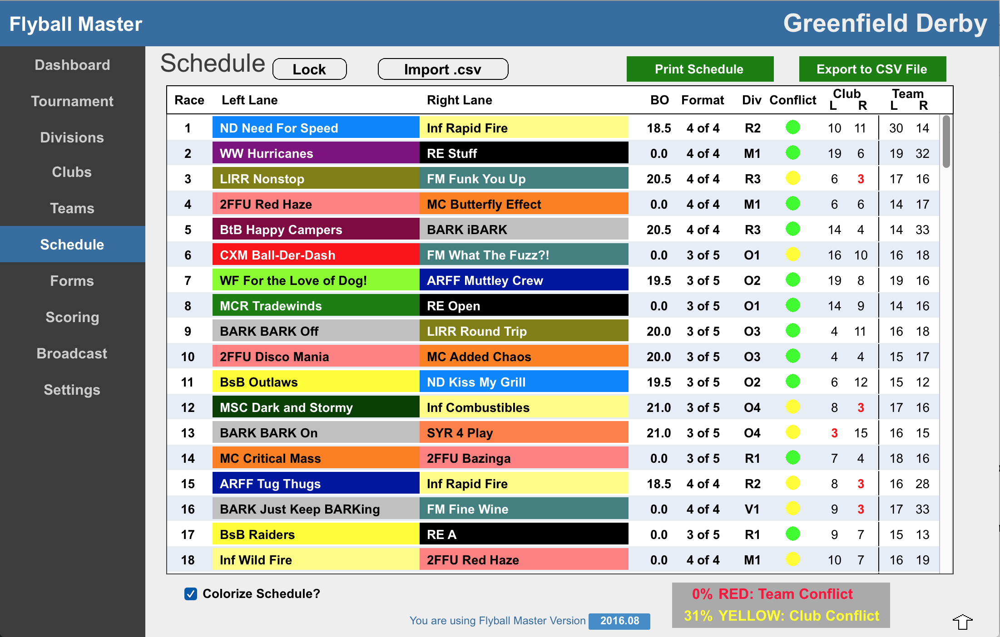

# Tournament Schedule

###Overview

Flyball Master version 1.0 does not create a Tournament schedule. Import the schedule from an external source. The schedule import should be the first activity when setting up a new Tournament.

This section details the process to import a schedule, the format needed, and steps to take after the import is complete.



###Schedule Import

Flyball Master allows a schedule importing from a comma separated value file (CSV). The format of the file is critical. 

### Import File Format

The following line defines the format. **The first line of the file must be the data for Race #1.**

```
Race Num, Left Team, Right Team, Breakout Time, Race Format, Division<return>
```

A sample line of data should look like:

```
1,MC Butterfly Effect,WW Hurricanes,0,3 of 5,M1<return>
```

##Data Conventions

###Race Num
Must be an integer number starting at 1 (ie. 1, 2, 3...)

###Left and Right Teams
Word 1 must be an abbreviation for the team's club name. This ideally should be no more than 4 letters and ALL CAPS. The remaining words are the team name. 

In the example line above, MC is the club abbreviation of "Mass Chaos" and "Butterfly Effect" is the team name.

###Breakout Time
Must be a number. For divisions with no breakout time use "0".

###Race Format
Must be text. The data must be of the form "<integer> of <integer>". Examples are "3 of 5" or "4 of 4".

###Division
Must be a single letter {O, R, M, V} representing the class followed by an number.

###More Information
Upon importing the schedule, any division or club that is not existing in the data file are created. Also, all teams are added to the event.

###Schedule Export
After creating a schedule, you can export it out of Flyball Master. The export file is a comma separated value file (CSV). Open the File in Google Sheets or Excel to create a "pretty" version of the schedule. Typically this pretty schedule becomes the view used for Participants of the Tournament.

###Schedule Lock
It is critical that the schedule not change once finalize. Click the "Lock" button to lock the schedule. Once the schedule is locked, it is not possible to make any changes to the schedule.


